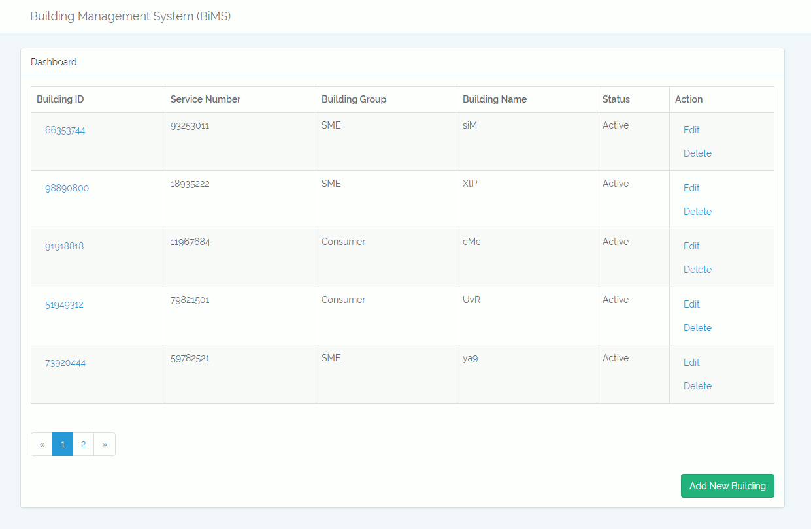

# Building Management System (BiMS)
A simple CRUD web application developed with Laravel

# Installation
1. Clone the repo and cd into it
2. ```composer install```
3. ```php artisan key:generate```
4. Create a database and set the credentials in ```.env``` file
5. ```php artisan migrate --seed```
6. If you are using XAMPP, visit ```localhost/bims/public/``` in your browser
